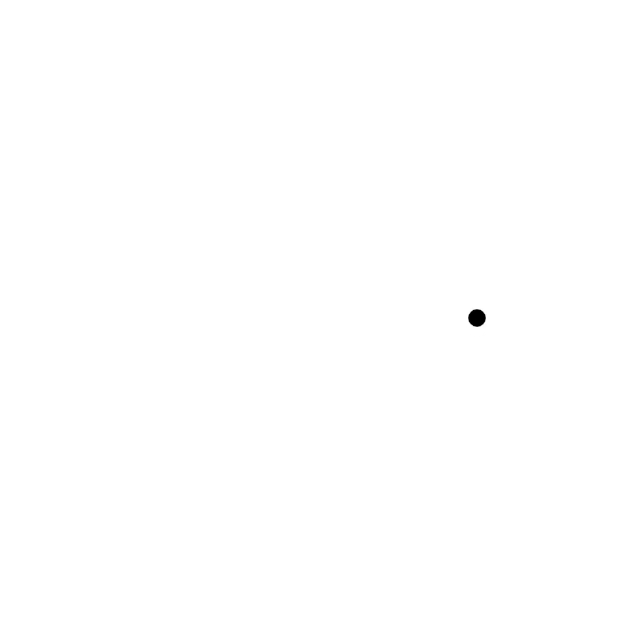

<p>
  <h2 align="center">p5-MediaRecorder</h2>
</p>
<p align="center">
  Record p5 sketches into webm.
</p>

<p align="center">
  
</p>

### Try it out

- Go to [demo](https://p5-mediarecorder.netlify.app)
  - _Alternatively, clone this repo and double click `index.html`._
- Click anywhere on the canvas.
- Wait one loop to download `test.webm`.

### The problem

[ccapture.js](https://github.com/spite/ccapture.js) fails to record p5 sketches into GIF for me. It fails with some very strange errors and as the library has too many open issues, I don't feel like digging deeper.

With some Googling I found the [`MediaRecorder` API](https://developer.mozilla.org/en-US/docs/Web/API/MediaRecorder) that can easily convert p5 sketches into webm videos, which can then be converted to mp4/GIF.

Writing this down for my own future reference.

### My workflow

- Use [`MediaRecorder` API](https://developer.mozilla.org/en-US/docs/Web/API/MediaRecorder) to generate webm video
- Use [Handbrake](https://handbrake.fr) to convert webm video into any video
- Use [Gifski](https://gif.ski) to convert the videos to GIFs

### The Code

```js
let canvas
const dim = 400
let isRecording = false
let recordingLength = 5000
let deg = 0

function setup() {
  canvas = createCanvas(dim, dim)
  fill('black')
}

let recorder
function draw() {
  background('white')

  if (frameCount === 1) {
    recorder = startRecording()
  }

  radians(deg)

  translate(dim / 2, dim / 2)
  circle(100 * cos(radians(deg)), 100 * sin(radians(deg)), 10)

  deg++

  if (deg === 360) {
    recorder.stop()
    noLoop()
  }
}

function startRecording() {
  console.log('start recording')

  const chunks = []
  const stream = canvas.elt.captureStream()
  const recorder = new MediaRecorder(stream)
  recorder.ondataavailable = (e) => chunks.push(e.data)
  recorder.onstop = (e) => {
    exportVid(new Blob(chunks, { type: 'video/webm' }))
    console.log('done recording')
  }

  recorder.start()
  return recorder
}

function exportVid(blob) {
  const url = URL.createObjectURL(blob)
  const a = document.createElement('a')
  a.style.display = 'none'
  a.href = url
  a.download = 'test.webm'
  a.click()
  window.URL.revokeObjectURL(url)
}
```
